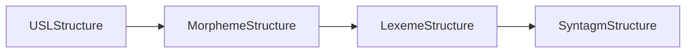
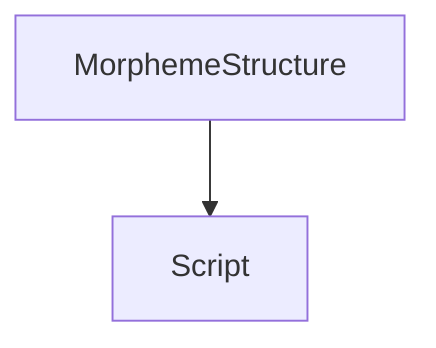
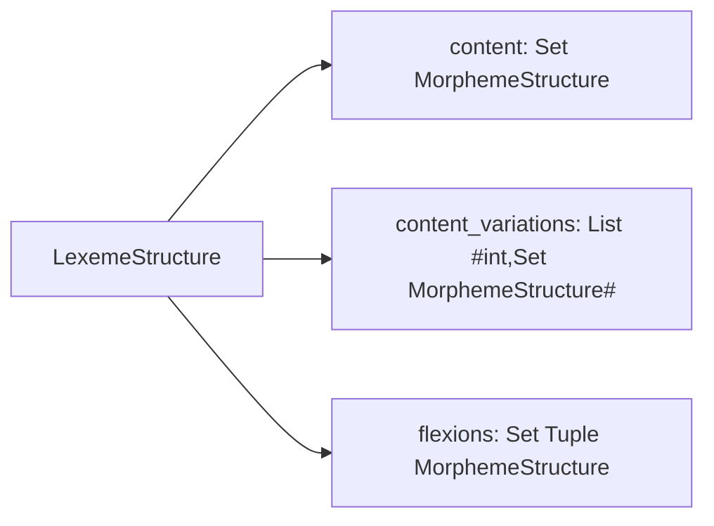
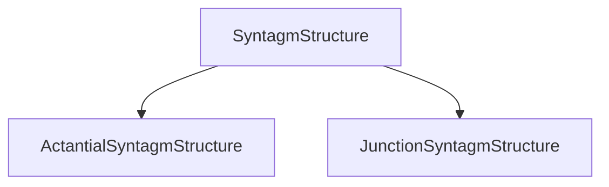
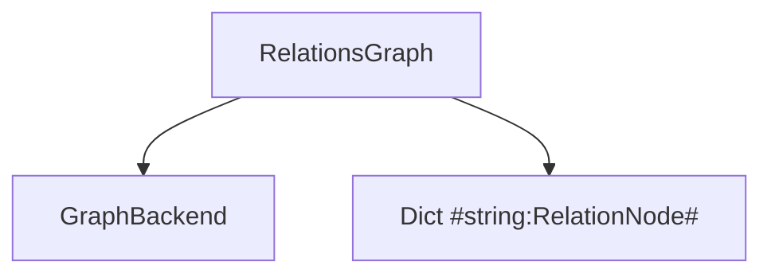
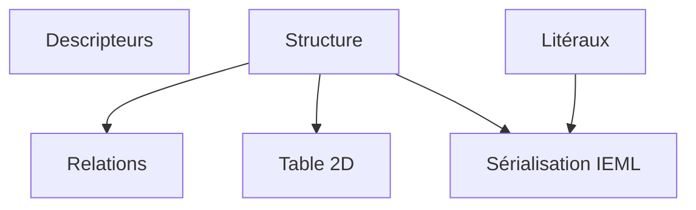

# Interface de la lib. IEML

## Interface des `USL`

### Attributs
|                |Nom de l'attribut (conv. python) |Type  |  Description                        |
|------------------|---------------|------|------------------------------------|
|Structure         | `structure`   |`USLStructure`| Arbre syntaxique, il peut être de sous-type `MorphemeStructure`, `LexemeStructure`, `SyntagmStructure` |
|Relations         | `relations`   |`RelationNode`| Noeud dans un graphe de relations |
|Littéraux          | `literals`    |`Dict{USLPath:Literal}` | Les valeurs  |
|Descripteurs      | `descriptors` |`Descriptor`| Traductions, références wikipédia, commentaires, tags|

### Methods

|                |Nom de la méthode | Arguments | Type retour   |  Description                        |
|------------------|---------------|------|--------------------------------|----|
|Sérialisation IEML| `__str__`     | | String| Représentation normalisée de l'USL  | 
|Duplication | `clone` | | `USL` | |
|Table 2D | `table2d` | `(USLPath, USLPath)`| `USLTable2D` | |

## Interface de `USLStructure`

Héritage:

#### Attributs
|                |Nom de l'attribut |Type  |  Description                        |
|----------------|---------------|------|------------------------------------|
| Classe de traduction | `translation_class`| `Script`|  |

#### Methods

|                |Nom de la méthode | Arguments | Type retour   |  Description                        |
|------------------|---------------|------|--------------------------------|----|
| Render Structure | `to_str` | | `String` | Retourne la chaîne de caractères IEML normalisées associé à la structure |

### Interface de `MorphemeStructure`

#### Attributs

|                |Nom de l'attribut |Type  |  Description                        |
|----------------|---------------|------|------------------------------------|
| Script | `script`| `Script`| le morphème |
#### Methods

|                |Nom de la méthode | Arguments | Type retour   |  Description                        |
|------------------|---------------|------|--------------------------------|----|
| Init `MorphemeStructure` | `__init__` | `Script` | `MorphemeStructure` | |

### Interface de `LexemeStructure`

#### Attributs
|                |Nom de l'attribut |Type  |  Description                        |
|----------------|---------------|------|------------------------------------|
| Content | `content`| `Set[MorphemeStructure]`| le contenue du lexème |
| Variations de contenu | `content_variations`| `List[int,Set[MorphemeStructure]]`| les groupes et multiplicité des groupes de variations du lexème. |
| Flexions | `flexions` | `Set[Tuple[MorphemeStructure]]` | les flexions du lexèmes|

#### Methods

|                |Nom de la méthode | Arguments | Type retour   |  Description                        |
|------------------|---------------|------|--------------------------------|----|
| Init `LexemeStructure` | `__init__` | `(Set[MorphemeStructure], List[int,Set[MorphemeStructure]], Set[Tuple[MorphemeStructure]])` | `LexemeStructure` | |

### Interface de `SyntagmStructure`

Héritage:

#### Attributs

|                |Nom de l'attribut |Type  |  Description                        |
|----------------|---------------|------|------------------------------------|

#### Methods

|                |Nom de la méthode | Arguments | Type retour   |  Description                        |
|------------------|---------------|------|--------------------------------|----|

### Interface de `ActantialSyntagmStructure`

#### Attributs
||||
|----------------|---------------|------|
|`initiator` | `recipient` | `interactant` |
| `location` | `lexeme`| `time`  |
| `intention` | `manner`| `cause`|

|                |Nom de l'attribut |Type  |  Description                        |
|----------------|---------------|------|------------------------------------|
| Lexème | `lexeme`| `LexemeStructure`| le lexème à la racine |
| Initiator | `initiator`| `SyntagmStructure|None`| le initiator du lexème |
| Recipient | `recipient`| `SyntagmStructure|None`| le recipient du lexème |
| Interactant | `interactant` | `SyntagmStructure|None`| le interactant du lexème |
| Location | `location` | `SyntagmStructure|None`| le location du lexème |
| Time | `time` | `SyntagmStructure|None`| le time du lexème |
| Intention | `intention` | `SyntagmStructure|None`| le intention du lexème |
| Manner | `manner` | `SyntagmStructure|None`| le manner du lexème |
| Cause | `cause` | `SyntagmStructure|None`| le cause du lexème |

#### Methods

|                |Nom de la méthode | Arguments | Type retour   |  Description                        |
|------------------|---------------|------|--------------------------------|----|
| Init `ActantialSyntagmStructure` | `__init__` | `(LexemeStructure, SyntagmStructure...)` | `ActantialSyntagmStructure` | |

### Interface de `JunctionSyntagmStructure`

#### Attributs

|                |Nom de l'attribut |Type  |  Description                        |
|----------------|---------------|------|------------------------------------|
| Type de jonction | `junction_type`| `Script`| le script de type de jonction |
| Enfants | `children`| `List[SyntagmStructure]`| le script de type de jonction |

#### Methods

|                |Nom de la méthode | Arguments | Type retour   |  Description                        |
|------------------|---------------|------|--------------------------------|----|
|Init JunctionSyntagmStructure| `(Script, List[SyntagmStructure]`| `JunctionSyntagmStructure` | 

## Interface de `Descriptor`
Un descriptor est une fiche de description pour un USL donné. Les descriptions sont versionnées, la présence d'une description non vide indique que l'USL est définie dans la base de données.

#### Attributs
|                |Nom de l'attribut |Type  |  Description                       |
|----------------|---------------|------|------------------------------------|
|Version Descripteurs | `version` | `DescriptorVersion\|None` | version des descripteurs dans `DescriptorDB` ou `None`|
| translations | `translations` | |
| comments | `comments` | |
| urls | `urls` |  |
| tags |  `tags` |  |

#### Methods
|                |Nom de la méthode | Arguments | Type retour   |  Description |
|------------------|---------------|------|--------------------------------|----|
| Init Descriptor | `__init__` | ||
| Est vide | `is_empty` ||||
| Set va

### Interface de `DescriptorDB`
#### Attributs

## Interface de `RelationsGraph`

Relation graphe permet de d'entretenir (dans RelationsBackend) un graphe de relations automatiquement générer à partir des USLs

#### Attributs

|                |Nom de l'attribut|Type  |  Description                        |
|----------------|---------------|------|------------------------------------|
|Triples Backend |`graph_backend`|`GraphBackend`| Base de données de triples |
|Noeuds| `nodes` | `Dict[string,RelationNode]`| Les noeuds du graphe|

#### Methods

|                |Nom de la méthode | Arguments | Type retour   |  Description                        |
|------------------|---------------|------|--------------------------------|----|
|Init relation graph | `__init__`| `(GraphBackend, List[UslStructure])`|`RelationsGraph`||
| Get relations (no add) |`get`| `UslStructure|string` | `RelationNode` | Renvoie les relations sans ajouter l'USL (pas d'effet de bord)|
|Add USL to graph and get relations | `set`| `UslStructure|string` | `RelationNode` | Renvoie les relations en ajoutant l'USL (modifie le graphe)|

### Interface de `RelationNode`
#### Attributs

|                |Nom de l'attribut |Type  |  Description                    |
|----------------|---------------|------|------------------------------------|
|relations		 |`relations` | `Dict[RelationType, USL]` | Les relations de ce noeud |
#### Methods

|                |Nom de la méthode | Arguments | Type retour   |  Description                        |
|------------------|---------------|------|--------------------------------|----|

## Interface de `USLParser`
#### Attributs
|                |Nom de l'attribut (conv. python) |Type  |  Description                        |
|----------------|---------------|------|------------------------------------|
|scripts         | `scripts`   |`List[Script]`| Liste de script que le parseur peut utiliser pour parser les USL|
|BD Descriptor   | `descriptor_database`   |`DescriptorDatabase`| Base de données des descripteurs que le parseur utilise pour initialiser les USLs|
|Graphe de relations   | `relations_graph`   |`RelationsGraph`| Base de données des descripteurs que le parseur utilise pour initialiser les USLs|

#### Methods

|                |Nom de la méthode | Arguments | Type retour   |  Description                        |
|------------------|---------------|------|--------------------------------|----|
|Init USLParser | `__init__` | `(List[Script], DescriptorDatabase?, RelationsGraph?)`| `USLParser` | Crée un nouveau parser|
|Parse USL| `parse`| `String` | `USL` | Parse la chaine en un `USL` ou lève l'exception `CannotParse`  | 

# Diagrammes de dépendences

